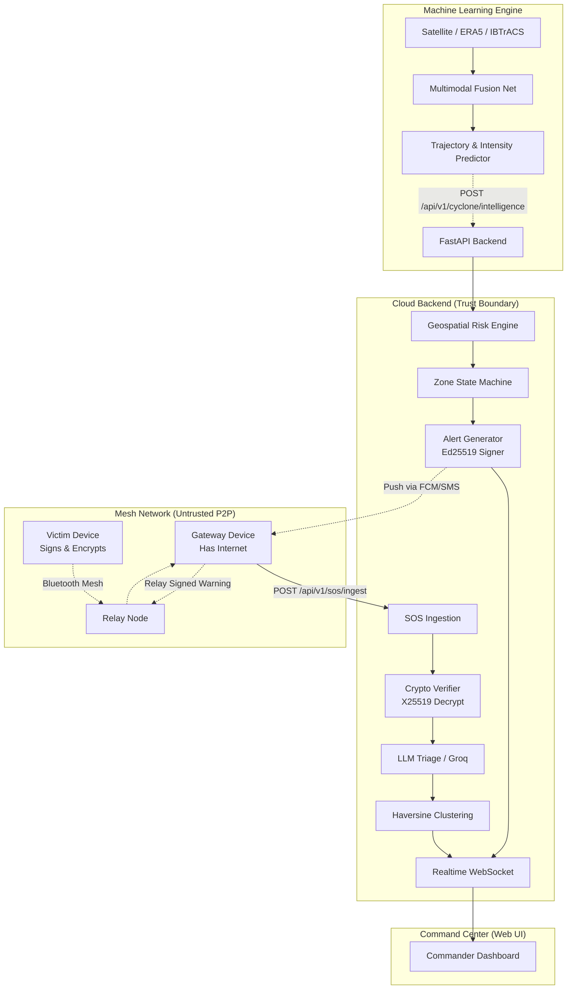

# 🌀 Chakravyooh (चक्रव्यूह)

> **Chakravyooh** is an AI-powered disaster intelligence platform and offline-first emergency mesh network. 

Conventional disaster response systems are largely reactive—they wait for destruction to happen before activating emergency workflows. Chakravyooh completely re-engineers this paradigm by operating across the entire lifecycle of a disaster: 

**Detect → Understand → Predict → Assess Risk → Warn → Deliver → Survive Network Failure**

---

## 🏛 Core Capabilities

The platform combines two major operational capabilities:

### 1. Cyclone Intelligence Pipeline (Proactive)
Powered by multi-source machine learning models (Satellite IR, Environmental data, Ocean tracks), Chakravyooh identifies and tracks tropical cyclones long before they make landfall.
- **AI Tracking:** Tracks trajectory, velocity, and stages using PyTorch baselines.
- **Geospatial Risk Engine:** Uses haversine math to intersect predicted cyclone cones with pre-defined population zones, assigning real-time dynamic threat levels (`NORMAL` -> `EMERGING` -> `HIGH` -> `CRITICAL` -> `EXTREME`).
- **Offline Cryptographic Alerts:** Automatically generates and signs `CYCLONE_WARNING` alerts using backend authority `Ed25519` keys, versioning them as the risk escalates.

### 2. Resilient Mesh Infrastructure (Reactive/Survival)
When disasters inevitably knock out cell towers and internet, ordinary Android phones form a self-healing mesh:
- **Offline Relay:** A victim's SOS hops phone-to-phone over Bluetooth/Wi-Fi Aware with no network at all, until it reaches a single phone with connectivity.
- **Zero-Trust Security:** Every SOS message is signed with `Ed25519` and payload-encrypted with `X25519`. Relay nodes cannot read or tamper with packets.
- **AI Triage:** On reaching the cloud, an LLM layer (Groq/Llama 3) extracts intent and assigns a triage priority score (1-100), routing critical emergencies to commanders instantly.

---

## 🏗 System Architecture

The Chakravyooh ecosystem spans ML inference, Cloud services, Web Dashboards, and Android native mesh networks.



---

## 🛠 Tech Stack

**Backend Services**
- **Language:** Python 3.11+
- **Framework:** FastAPI
- **Database:** PostgreSQL (Neon DB) + SQLAlchemy AsyncIO
- **Cryptography:** PyNaCl (`Ed25519` signing, `X25519` SealedBox encryption)
- **AI Triage:** Groq API (Llama 3)
- **Realtime:** WebSockets (Outbox Pattern)

**Machine Learning**
- **Framework:** PyTorch, Torchvision
- **Data Prep:** Pandas, Scikit-learn
- **Data Sources:** ERA5, IBTrACS, Digital Typhoon IR

**Client Applications**
- **Android:** Native Kotlin, Bluetooth Low Energy (BLE) Mesh
- **Web:** HTML/CSS/JS, React Dashboard

---

## 🔒 Cryptographic Security Model

Because the P2P mesh network is inherently untrusted, Chakravyooh enforces a strict zero-trust boundary at the cloud layer:

1. **SOS Encryption:** The plaintext payload of a distress call is encrypted using the Backend's `X25519` public key.
2. **SOS Authentication:** 15 immutable fields are packed into canonical bytes and signed using `Ed25519`. Modification by a relay node immediately triggers a `401 BAD_SIGNATURE`.
3. **Alert Verification:** The backend signs generated warnings (`CYCLONE_WARNING`) with its own private authority key. Offline Android clients cache the authority public key to verify incoming mesh alerts before displaying them.
4. **Idempotency:** Replay attacks are stopped by a strict ±5 minute clock-drift window and a database-backed unique constraint.

---

## 🚀 Getting Started (Backend Development)

The backend is entirely containerized and ready for rapid local development.

### Prerequisites
- Python 3.11+
- PostgreSQL (Local or Neon DB)

### Setup Instructions

1. **Clone the repository:**
   ```bash
   git clone https://github.com/RealArnav007/CHAKRAVYOOH.git
   cd CHAKRAVYOOH/services/backend
   ```

2. **Create a virtual environment:**
   ```bash
   python -m venv venv
   source venv/bin/activate  # Windows: .\venv\Scripts\activate
   pip install -r requirements.txt
   ```

3. **Environment Configuration:**
   Copy the example environment file and fill in your database/SMTP credentials.
   ```bash
   cp .env.example .env
   ```
   *(Note: If cryptographic keys like `JWT_SECRET_KEY` or `BACKEND_X25519_PRIVATE_KEY` are left blank, the app auto-generates ephemeral keys for local testing).*

4. **Run the server:**
   ```bash
   uvicorn src.main:app --reload --port 8000
   ```
   Visit `http://localhost:8000/docs` to view the interactive OpenAPI documentation.

### Running the Test Suite
The backend is protected by a comprehensive 67-suite `pytest` integration and unit test layer covering both the offline mesh ingestion and cyclone intelligence pathways.
```bash
pytest tests/ -v
```

---

## 🗺 Project Structure

```text
CHAKRAVYOOH/
├── ml/                             # Machine Learning Engine
│   └── cyclone/                    # Cyclone baseline models & PyTorch tracks
├── services/
│   └── backend/                    # Core FastAPI Backend
│       ├── src/
│       │   ├── api/                # REST Routes
│       │   ├── auth/               # JWT, Brevo OTP, RBAC
│       │   ├── cyclone/            # Cyclone Intelligence & Signed Alerts
│       │   ├── sos/                # SOS Ingestion & Deduplication
│       │   ├── incidents/          # Haversine Clustering
│       │   ├── zones/              # Severity State Machine
│       │   ├── ml/                 # AI Triage Interface (Groq)
│       │   └── database/           # SQLAlchemy Models
│       └── tests/                  # 67 Pytest Suites
├── frontend/                       # Web Dashboards
└── README.md
```

---
*Built to save lives when the grid goes dark.*
