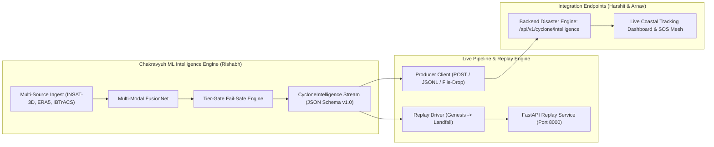

# 🌪️ Chakravyuh — Cyclone Intelligence & Emergency Response Platform

> **🎙️ The 60-Second Pitch:**  
> *"Chakravyuh is a physics-informed, multi-modal cyclone intelligence engine for the North Indian Ocean that fuses geostationary satellite IR, ERA5 atmospheric thermodynamics, and kinematic trajectories to forecast 0–72h tracks with calibrated uncertainty cones in under 90 milliseconds—guaranteed fail-safe via deterministic Tier-0 gating."*

---

## 🏗️ System Architecture & Subsystem Boundaries



---

## ⚡ Quickstart

### 1. Installation & Environment Verification
```bash
python3 -m venv .venv
source .venv/bin/activate
pip install -r ml/cyclone/requirements.lock.txt
```

### 2. Run Live Demo Dry-Run
```bash
python scripts/demo_dryrun.py --storm Amphan --jump landfall-24h
```

### 3. Run End-to-End Reproducibility Pipeline
```bash
./scripts/reproduce.sh --quick
```

### 4. Run Stream Producer Against Backend
```bash
python -m ml.cyclone.export.producer \
  --storm Amphan \
  --mode post \
  --endpoint http://localhost:8080/api/v1/cyclone/intelligence \
  --speed 1.0
```

### 5. Docker Deployment
```bash
docker build -t chakravyuh-cyclone-service -f serving/Dockerfile .
docker run -p 8000:8000 chakravyuh-cyclone-service
```

---

## 🧪 Verification & Model Card
- **Model Card:** [`ml/cyclone/MODEL_CARD.md`](file:///Users/rana/Documents/Chakravyooh/ml/cyclone/MODEL_CARD.md) (Complete ethical, technical, and latency specs).
- **Evaluation Report:** [`eval/CHAKRAVYUH_EVAL.md`](file:///Users/rana/Documents/Chakravyooh/eval/CHAKRAVYUH_EVAL.md) (Benchmark curves, confusion matrices, reliability diagrams).
- **Pitch Narration Notes:** [`eval/DEMO_STORM_NOTES.md`](file:///Users/rana/Documents/Chakravyooh/eval/DEMO_STORM_NOTES.md) (Talking points on Amphan, Fani, Biparjoy).
- **SOS Pipeline Integrity:** [`tests/test_sos_unbroken.py`](file:///Users/rana/Documents/Chakravyooh/tests/test_sos_unbroken.py) (Guarantees SOS distress scoring remains unbroken).

---
*Chakravyuh Platform — Defensible, Calibrated, Real-Time Cyclone Intelligence.*
