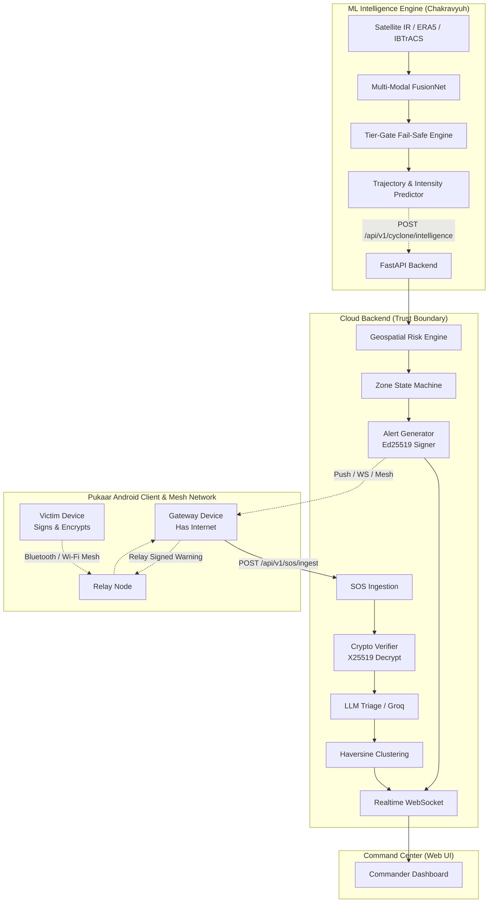

# 🌀 Chakravyooh (चक्रव्यूह) / Pukaar (पुकार)

> **Chakravyooh & Pukaar** is a physics-informed AI disaster intelligence platform and offline-first emergency mesh network.
> Conventional disaster response systems are largely reactive—they wait for destruction to happen before activating emergency workflows. Chakravyooh completely re-engineers this paradigm across the entire disaster lifecycle:
> **Detect → Understand → Predict → Assess Risk → Warn → Deliver → Survive Network Failure**

---

## 🏛 Core Architecture & Capabilities



---

## 📱 Pukaar Android Client

- **Animated UI Screens**: Full-screen splash with canvas cyclone rotation, 3-page onboarding with Keystore identity creation, home screen with 200dp sweeping radar widget and 2x2 situation cards.
- **Interactive Geospatial Cyclone Map**: Satellite Aubergine dark theme, glowing crosshair, forecast polylines, and uncertainty cones.
- **Decentralized Multi-Hop SOS**: Dual-tab (SEND & INBOX) with ECDSA signing, multi-hop relay dispatch, and triage indicators.
- **Mesh Status & Peer Graph**: Real-time interactive node visualization for Bluetooth LE and Wi-Fi Aware mesh nodes.
- **Hackathon Demo Mode**: One-touch toggle in Settings with simulated Arabian Sea cyclone (`CY-2026-001`), risk zones, and incoming flood distress.

---

## 🔒 Cryptographic Security Model

1. **Zero-Trust SOS Encryption:** Distress messages are encrypted with the Backend's `X25519` key.
2. **SOS Authentication:** Canonical packet fields signed with `Ed25519` / `ECDSA` (EC P-256).
3. **Alert Verification:** Backend authority key signs alerts; offline Android clients verify cryptographic integrity before display.
4. **Replay & TTL Protection:** ±5 minute timestamp window and database-backed message deduplication prevent packet spoofing and network congestion.

---

## ⚡ Quickstart

### 1. ML & Backend Services
```bash
# Python Virtual Environment
python3 -m venv .venv
source .venv/bin/activate
pip install -r ml/cyclone/requirements.lock.txt

# Run Live Demo Dry-Run
python scripts/demo_dryrun.py --storm Amphan --jump landfall-24h

# Run Backend
cd services/backend
pip install -r requirements.txt
uvicorn src.main:app --reload --port 8000
```

### 2. Android App (Pukaar)
```bash
cd android
./gradlew assembleDebug
```

---

## 🧪 Verification & Evaluation
- **Model Card:** [`ml/cyclone/MODEL_CARD.md`](file:///Users/rana/Documents/Chakravyooh/ml/cyclone/MODEL_CARD.md)
- **Evaluation Report:** [`eval/CHAKRAVYUH_EVAL.md`](file:///Users/rana/Documents/Chakravyooh/eval/CHAKRAVYUH_EVAL.md)
- **Pitch Narration Notes:** [`eval/DEMO_STORM_NOTES.md`](file:///Users/rana/Documents/Chakravyooh/eval/DEMO_STORM_NOTES.md)
- **SOS Pipeline Integrity:** [`tests/test_sos_unbroken.py`](file:///Users/rana/Documents/Chakravyooh/tests/test_sos_unbroken.py)

---
*Built to save lives when the grid goes dark.*
