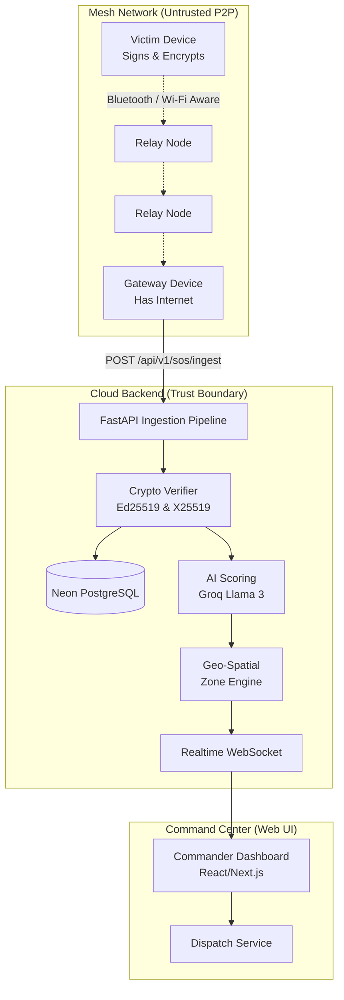

# Pukar (Project Beacon) 🚨

> **Pukar** is an offline-first emergency communication platform. When disasters knock out cell towers and internet, ordinary Android phones form a self-healing mesh: a victim's SOS hops phone-to-phone over Wi-Fi Aware/Bluetooth with no network at all, until it reaches a single phone that still has connectivity — which silently forwards it to a cloud command center. Every message is end-to-end encrypted and signed, so relay phones can't read or tamper with it. On arrival, on-device and cloud AI grade severity, cluster reports into incidents, and hand officials a live, prioritized dispatch map. Phone = communicate. Backend = understand. Web = act.

---

## 🏛 System Architecture

The Pukar ecosystem is divided into three distinct operational domains:



### 1. The Gateway (Android/Hardware)
- **Role:** Generates localized mesh network protocols and bridges the offline gap.
- **Security:** Victims use `Ed25519` to sign the metadata (coordinates, timestamp, device ID) and `X25519` SealedBox (ChaCha20-Poly1305) to encrypt the payload. Relay nodes forward this blindly without the ability to read or tamper.

### 2. The Cloud Backend (Python / FastAPI)
- **Role:** The authoritative security boundary and data processing engine.
- **Core Tech:** Python 3.11+, FastAPI, SQLAlchemy (Async), PostgreSQL (Neon DB).
- **Pipelines:**
  - **Security Gate:** Checks for ±5 min Replay Attacks, Idempotent UUID deduplication, and byte-exact `Ed25519` Canonical Verification.
  - **Geospatial Engine:** Uses Haversine formulas to automatically cluster nearby SOS reports (<500m, <2 hours) into unified `Incidents`.
  - **Zone State Machine:** Upgrades geographical zones through strict severity levels (`NORMAL` $\rightarrow$ `EMERGING` $\rightarrow$ `HIGH` $\rightarrow$ `CRITICAL` $\rightarrow$ `EXTREME`).

### 3. AI & ML Seam (Groq Llama 3)
- **Role:** Understand unstructured payload text (e.g., "trapped under rubble, smelling gas").
- **Seam:** An isolated interface extracts intent, assigns priority scores (1-100), and categorizes emergencies (Medical, Fire, Flood, Riot). Falls back deterministically if the upstream API fails.

### 4. Command Center (Web Frontend)
- **Role:** Operational visibility for commanders and responders.
- **Realtime:** Listens to the `/ws/dashboard` WebSocket (secured via JWT) to instantly update live incident maps and dispatch units dynamically.

---

## 🔒 Cryptographic Security Model

Because the P2P mesh network is inherently untrusted (any device can act as a relay), Pukar enforces a strict zero-trust model at the cloud boundary.

1. **Serialization:** 15 immutable fields are pipe-delimited (`|`) in a strict order into canonical bytes.
2. **Authentication:** The canonical bytes are signed using `Ed25519`. Any modification by a relay node instantly invalidates the signature, triggering a `401 BAD_SIGNATURE` at the backend.
3. **Confidentiality:** The plaintext payload is encrypted using the Backend's `X25519` public key. Only the backend can decrypt the payload.
4. **Idempotency:** Replay attacks are stopped by a strict ±5 minute clock-drift window and a database-backed `msg_id` unique constraint.

---

## 🚀 Getting Started (Backend Development)

The backend is entirely containerized and ready for rapid local development.

### Prerequisites
- Python 3.11+
- PostgreSQL (Local or Neon DB)

### Setup Instructions

1. **Clone the repository & enter the backend:**
   ```bash
   git clone https://github.com/RishabhRana37/Pukar.git
   cd Pukar/services/backend
   ```

2. **Create a virtual environment:**
   ```bash
   python -m venv venv
   source venv/bin/activate  # Windows: .\venv\Scripts\activate
   pip install -r requirements.txt
   ```

3. **Environment Configuration:**
   Copy the example environment file and fill in your database/SMTP credentials.
   ```bash
   cp .env.example .env
   ```
   *(Note: If `JWT_SECRET_KEY` or `BACKEND_X25519_PRIVATE_KEY` are left blank, the app will auto-generate ephemeral keys for local development).*

4. **Run the server:**
   ```bash
   uvicorn src.main:app --reload --port 8000
   ```
   Visit `http://localhost:8000/docs` to view the interactive OpenAPI documentation.

### Running the Test Suite
The backend is protected by a comprehensive 18-suite `pytest` integration test layer.
```bash
pytest tests/ -v
```

---

## 🗺️ Project Structure

```text
Pukar/
├── beacon/                         # Master PRD and Protocol Specs
├── services/
│   └── backend/                    # Core Python API
│       ├── src/
│       │   ├── api/                # REST Routes & WebSocket
│       │   ├── auth/               # JWT, Brevo OTP, RBAC Roles
│       │   ├── security/           # Crypto verifiers & rate limiters
│       │   ├── sos/                # Ingestion Pipeline & Deduplication
│       │   ├── incidents/          # Haversine Correlation Engine
│       │   ├── zones/              # Severity State Machine
│       │   ├── dispatch/           # Unit dispatch logic
│       │   ├── ml/                 # AI Scoring Interface (Groq)
│       │   └── database/           # SQLAlchemy Models
│       ├── tests/                  # Integration & Unit Tests
│       ├── Dockerfile              # Render Production Image
│       └── pytest.ini
└── README.md
```

---
*Built to save lives when the grid goes dark.*
