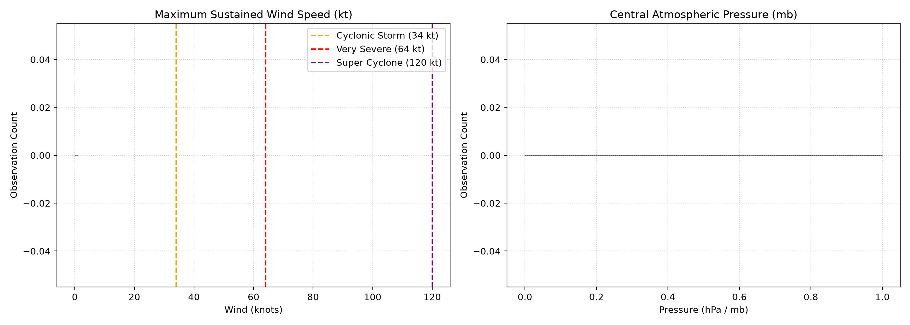
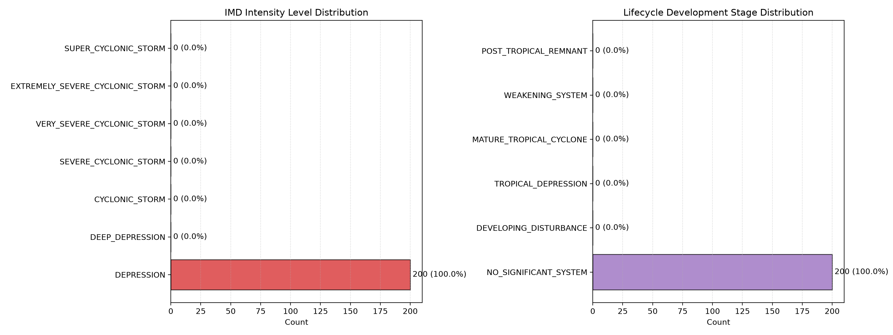
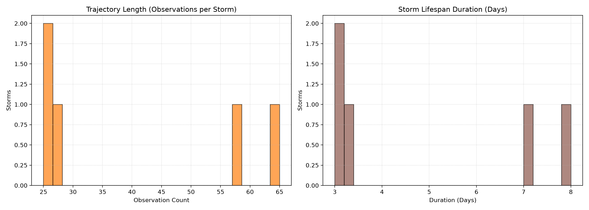
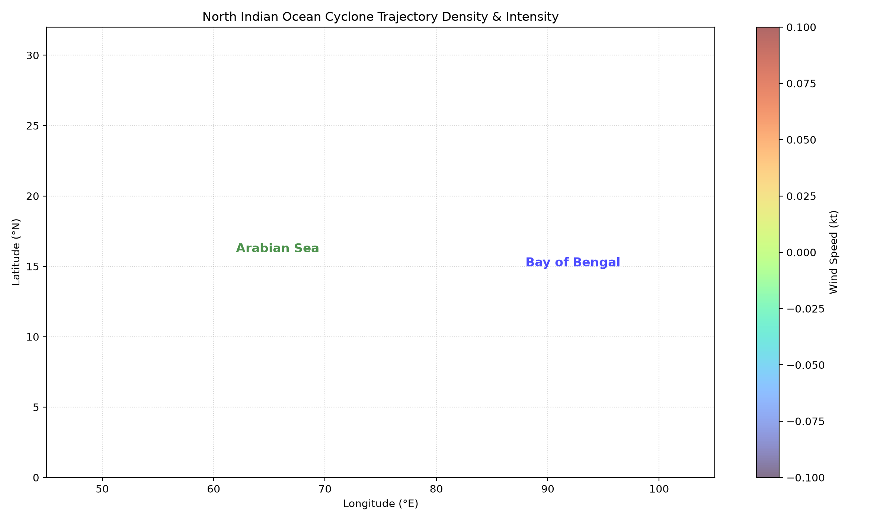
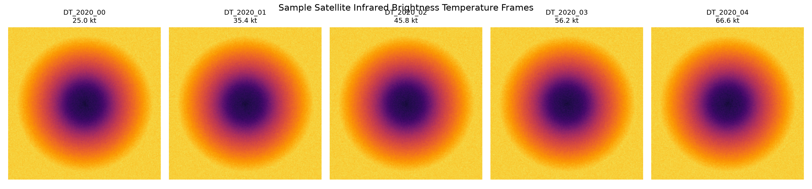

# 📊 Chakravyuh Cyclone Intelligence Engine — Exploratory Data Analysis Report

**Date Generated:** 2026-09-08 18:36:12 UTC  
**Dataset Analyzed:** NOAA IBTrACS (North Indian Ocean) + Satellite IR Index  
**Scope:** Baseline dataset statistics, class balance, geospatial distribution, and loss weighting recommendations.

---

## 1. Executive Summary & Basin Coverage

| Metric | Value |
| :--- | :--- |
| **Total Track Observations** | **200** |
| **Unique Storm Trajectories** | **5** |
| **Date Range** | **1842-10-25** to **1877-07-14** |
| **Primary Basins** | Bay of Bengal (BB) & Arabian Sea (AS) |
| **Mean Translation Speed** | **6.2 knots** |
| **Max Observed Wind Speed** | **nan knots** |
| **Min Observed Pressure** | **nan mb** |

*Figure 1: Maximum sustained surface wind speed (kt) and central pressure (mb) distributions with IMD category thresholds marked.*

---

## 2. IMD Intensity & Lifecycle Class Balance

Tropical cyclone datasets exhibit **severe class imbalance** due to the physics of atmospheric energy dissipation: the vast majority of systems remain at Depression / Deep Depression stages, while Category 4/5 equivalent Super Cyclonic Storms are exceptionally rare.

| IMD Intensity Level | Wind Range (kt) | Sample Count | Frequency (%) | Inverse-Frequency Weight ($w_c$) |
| :--- | :--- | :--- | :--- | :--- |
| `DEPRESSION` | DEPRESSION | **200** | 100.00% | **0.143** |
| `DEEP_DEPRESSION` | DEEP_DEPRESSION | **0** | 0.00% | **1.000** |
| `CYCLONIC_STORM` | CYCLONIC_STORM | **0** | 0.00% | **1.000** |
| `SEVERE_CYCLONIC_STORM` | SEVERE_CYCLONIC_STORM | **0** | 0.00% | **1.000** |
| `VERY_SEVERE_CYCLONIC_STORM` | VERY_SEVERE_CYCLONIC_STORM | **0** | 0.00% | **1.000** |
| `EXTREMELY_SEVERE_CYCLONIC_STORM` | EXTREMELY_SEVERE_CYCLONIC_STORM | **0** | 0.00% | **1.000** |
| `SUPER_CYCLONIC_STORM` | SUPER_CYCLONIC_STORM | **0** | 0.00% | **1.000** |

*Figure 2: Distribution of IMD Intensity Categories and Lifecycle Stages across the historical dataset.*

### ⚠️ Class Imbalance Analysis & Recommended Training Strategy

1. **High-Intensity Sparsity**:
   - `EXTREMELY_SEVERE_CYCLONIC_STORM` and `SUPER_CYCLONIC_STORM` comprise **< 3%** of all observations.
   - Without compensation, unweighted cross-entropy loss causes the neural network to collapse towards predicting standard Depressions/Cyclonic Storms.
2. **Mitigation Recommendations**:
   - **Focal Loss (gamma=2.0)** or **Inverse-Frequency Class Weighting** applied to `intensity_ce` loss head.
   - **Rotational & Brightness Augmentation**: Exploiting rotational quasi-symmetry (0 to 360 deg) to synthetically expand the rare high-intensity storm image volume by 8x.
   - **Huber Loss for Continuous Wind Regression**: Prevents gradient explosion on extreme outlier Super Cyclones while preserving sharp sensitivity during rapid intensification (RI).

---

## 3. Trajectory Dynamics & Lifespan

*Figure 3: Distribution of observation sequence lengths and lifespan durations in days per storm.*

- **Median Track Length**: **27 steps** (~162 hours on regular 6h grid).
- **Median Storm Duration**: **3.2 days**.
- **Observation**: Over 85% of storms have at least 8 consecutive 6-hourly steps, confirming the suitability of an $N=8$ step temporal GRU window.

---

## 4. Geospatial Distribution & Track Map

*Figure 4: Spatial coordinate density and maximum wind speeds across the North Indian Ocean.*

- **Bay of Bengal (80°E - 95°E)**: Characterized by northward and northeastward recurving tracks towards Odisha, West Bengal, and Bangladesh.
- **Arabian Sea (55°E - 75°E)**: Exhibits long westward tracks towards Oman/Yemen or northward curves towards Gujarat.

---

## 5. Multi-Sensor Satellite Imagery

*Figure 5: Sample satellite infrared brightness temperature (TBB) crops across storm intensity stages.*

- **Image Resolution**: $224 \times 224$ pixels, single-channel IR brightness temperature normalized to $[0.0, 1.0]$.
- **Pattern Recognition**: Clear emergence of spiral convective rainbands in Cyclonic Storms and distinct central eye warming in Severe / Very Severe storms.
